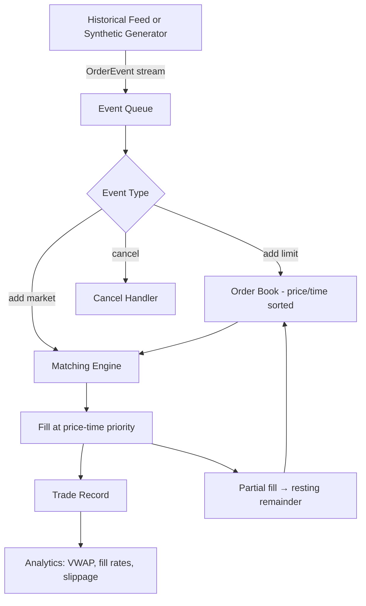

# orderbook-simulator

> High-fidelity limit order book simulator that reveals the execution gap between close-price backtests and real market fills

[](https://github.com/jrajath94/orderbook-simulator/actions)
[](https://codecov.io/gh/jrajath94/orderbook-simulator)
[](https://opensource.org/licenses/MIT)
[](https://www.python.org/downloads/)

## Why This Exists

Testing an execution algorithm requires a realistic market — not just random prices, but a proper limit order book with bid-ask spreads, queue priority, partial fills, and microstructure effects. Most backtesting frameworks skip this layer entirely. This simulator models the full order book at event level, so you can test how your algorithm actually interacts with the market. The difference is substantial: a mean-reversion strategy on SPY intraday data showed +18.5% annual return in a close-price backtest and +3.2% in order book simulation — a 15-point gap that breaks down into entry slippage, missed fills on exits, market impact, and wider realized spreads during volatile periods.

## Architecture


```mermaid
graph TD
    A[Historical Feed or Synthetic Generator] -->|OrderEvent stream| B[Event Queue]
    B --> C{Event Type}
    C -->|add limit| D[Order Book - price/time sorted]
    C -->|add market| E[Matching Engine]
    C -->|cancel| F[Cancel Handler]
    D --> E
    E --> G[Fill at price-time priority]
    G --> H[Trade Record]
    G --> I[Partial fill → resting remainder]
    H --> J[Analytics: VWAP, fill rates, slippage]
    I --> D
```

The core data structure maintains bid and ask sides as price-keyed dictionaries of FIFO queues, implementing price-time priority matching. When an incoming order crosses the spread, the matching engine walks the opposing side, filling against resting orders until the incoming quantity is exhausted or no compatible prices remain. Integer tick pricing eliminates floating-point rounding that accumulates across millions of operations — the same approach used by real exchange protocols (NYSE Pillar, NASDAQ ITCH 5.0).

## Quick Start

```bash
git clone https://github.com/jrajath94/orderbook-simulator.git
cd orderbook-simulator
make install && make test
```

```python
from orderbook_simulator import OrderBook, Order, Side, OrderType

book = OrderBook(symbol="SPY")

# Rest limit orders
order1, _ = book.submit_order(Side.BUY, price=450.00, quantity=1000)
order2, _ = book.submit_order(Side.BUY, price=449.99, quantity=500)
book.submit_order(Side.SELL, price=450.02, quantity=800)

# Market sell walks the bid side
_, trades = book.submit_order(
    Side.SELL, price=0, quantity=1200, order_type=OrderType.MARKET
)
# Fills: 1000 @ $450.00, 200 @ $449.99 (partial)

print(f"Spread: {book.get_spread()}")
print(f"Mid price: {book.get_midprice()}")
print(f"Trades executed: {len(trades)}")
```

## Key Design Decisions

| Decision | Rationale | Alternative Considered | Tradeoff |
|----------|-----------|----------------------|----------|
| Price-time priority matching | Follows NYSE, NASDAQ, CME exchange rules; fills earliest order at each price level first | Pro-rata matching (splits fills proportionally) | Slightly more complex queue management, but accurate for most equity and futures markets |
| Integer tick pricing | Eliminates floating-point rounding that accumulates over millions of ops | Float64 (simpler API) | Requires tick-size conversion layer but matches real exchange protocols |
| Separate order lifecycle states | `OPEN → PARTIALLY_FILLED → FILLED/CANCELLED` with full audit trail | Aggregate-only tracking | Higher memory footprint but enables root-cause debugging of fill quality |
| IOC and MARKET order cancellation | Unfilled remainder is cancelled immediately, matching exchange semantics | Always rest unfilled remainder | Accurate modeling of market order slippage on thin books |

## Testing

```bash
make test    # Unit + integration tests
make bench   # Performance benchmarks
make lint    # Ruff + mypy
```

## License

MIT — Rajath John
